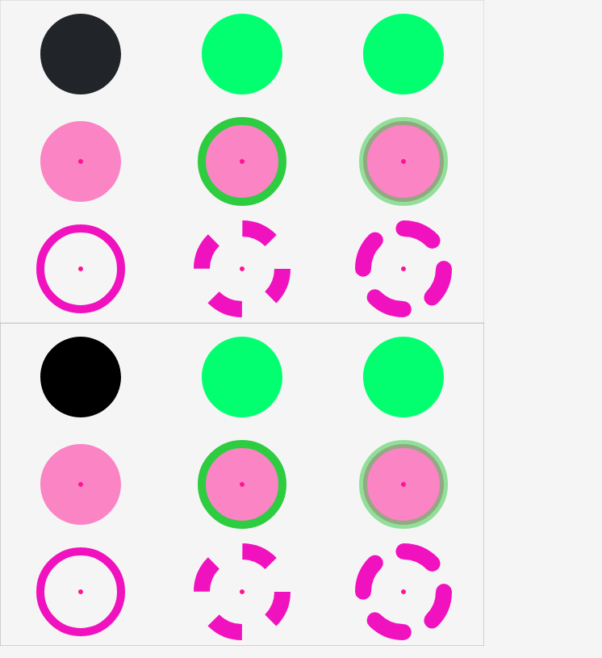
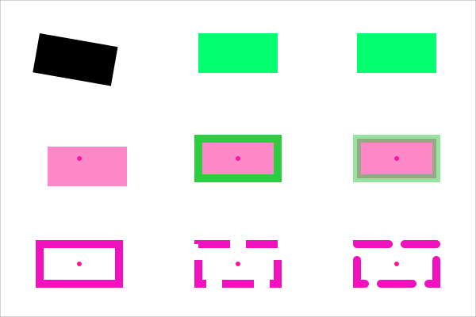
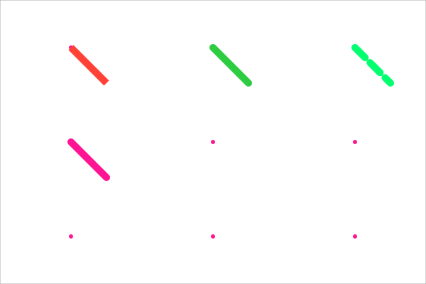
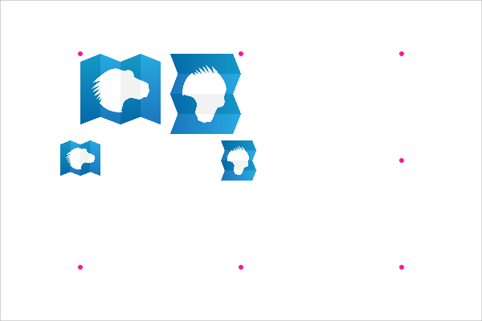

# CC-Sketch-Plus

Creative coding library that targets both Canvas and SVG with one API.

[CC-Sketch](https://github.com/MatthijsKamstra/cc-sketch) is a creative coding library written in Javascript via [Haxe](http://www.haxe.org).
This project started when I did a [30-days-challenge](https://matthijskamstra.github.io/creative-coding) and I decided it should be open-source.

<p align="center">
  
</p>

## Quick start

Minimal setup for SVG:

```haxe
package;

import sketcher.util.MathUtil;
import sketcher.util.ColorUtil;

class Main {
	public function new() {
		var settings = new Settings(800, 600, 'svg');
		settings.elementID = 'sketcher-svg-root';

		var sketch = Sketcher.create(settings).appendTo(js.Browser.document.body);

		for (i in 0...8) {
			var circle = sketch.makeCircle(MathUtil.random(800), MathUtil.random(600), 40 + i * 6);
			var color = ColorUtil.niceColor100[MathUtil.randomInt(ColorUtil.niceColor100.length - 1)];
			circle.setFill(color[0]);
		}

		sketch.update();
	}

	static public function main() {
		new Main();
	}
}
```

Build:

```bash
haxe build.hxml
```

## Examples

- Haxe examples live in [src/examples](src/examples)
- Gallery page: [docs/collection.html](docs/collection.html)
- Animation demo: [docs/animation.html](docs/animation.html)

Recommended starters:

- `ExAll.hx` - overview of shapes and styling
- `ExGradient.hx` - gradients
- `ExSvgA4.hx` - A4 layout with mm units

Minimal examples (with screenshots):

| Example              | Preview                                   |
| -------------------- | ----------------------------------------- |
| `ExMiniCircle.hx`    |     |
| `ExMiniRectangle.hx` |  |
| `ExMiniLine.hx`      |       |
| `ExMiniText.hx`      |       |
| `ExMiniImage.hx`     |      |

## API cheatsheet (Canvas/SVG)

Create a sketch:

```haxe
var settings = new Settings(800, 600, 'canvas'); // or 'svg'
settings.elementID = 'sketcher-root';
var sketch = Sketcher.create(settings).appendTo(js.Browser.document.body);
```

Core shapes:

```haxe
var circle = sketch.makeCircle(120, 120, 60);
var rect = sketch.makeRectangle(80, 200, 140, 90);
var line = sketch.makeLine(40, 40, 240, 180);
var text = sketch.makeText('Hello', 120, 40);
```

Styling:

```haxe
circle.setFill('#ff6b35');
circle.setStroke('#1f1f1f');
circle.lineWeight = 4;

rect.fillOpacity = 0.6;
rect.noStroke();
```

SVG-only helpers:

```haxe
var gradient = sketch.makeGradient('#2193b0', '#6dd5ed');
gradient.id = 'cool-blue';
rect.fillGradientColor = 'cool-blue';
```

Canvas-only helpers:

```haxe
// direct access to the canvas context
var ctx = sketch.canvas.getContext2d();
```

## Source

I have gotten some inspiration for this project from

<https://two.js.org/>

## Screenshot

example can be found <https://matthijskamstra.github.io/cc-sketch-plus/>


## Haxelib

How to install cc-sketch-plus

Use this git repos as a development directory:

```bash
haxelib dev cc-sketch-plus path/to/folder
```

or use this git-repository directly

```bash
haxelib git cc-sketch-plus https://github.com/MatthijsKamstra/cc-sketch-plus.git
```

don't forget to add it to your build file

```haxe
-lib cc-sketch-plus
```

## Notes

- Build targets live in the root `.hxml` files.
- SVG export uses the generated SVG string; canvas export uses canvas data URLs.
