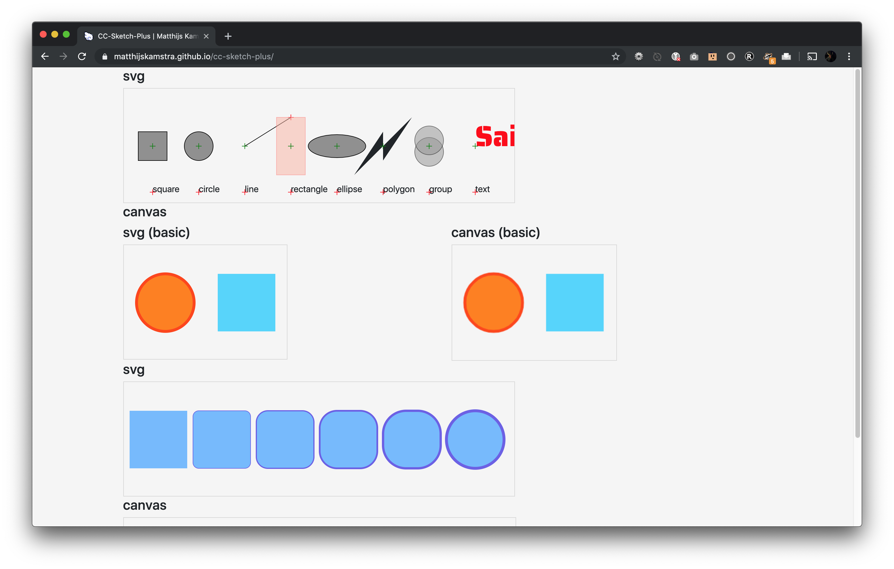

# CC-Sketch-Plus

Proof of concept to sketch in canvas and svg in one library.

[CC-Sketch](https://github.com/MatthijsKamstra/cc-sketch) is a creative coding library written in Javascript via [Haxe](http://www.haxe.org).
This project started when I did a [30-days-challenge](https://matthijskamstra.github.io/creative-coding) and I decided it should be open-source.

<p align="center">
  
</p>

## Quick start

```haxe
package;

import Globals.Globals.*;
import Settings.SizeType;
import sketcher.util.ColorUtil;
import sketcher.util.MathUtil;

class Main {
	public function new() {
		trace('Main');
		sketchSVG();
	}

	function sketchSVG() {
		// var size = (Paper.inPixel(Paper.PaperSize.A4));
		var size = (Paper.inMM(Paper.PaperSize.A4));

		var sketchWidth = size.width;
		var sketchHeight = size.height;

		// Make an instance of two and place it on the page.
		var settings:Settings = new Settings(Math.round(sketchWidth), Math.round(sketchHeight), 'svg');
		settings.isAnimation = false; // default is true (based upon canvas)
		settings.padding = 0;
		settings.isScaled = true; // (default is false)
		settings.sizeType = SizeType.MM;
		settings.viewBox = [0, 0, sketchWidth, sketchHeight];

		var sketch = SketcherSVG.create(settings).setup();

		var bg = sketch.makeBackground('white');

		for (i in 0...10) {
			var circle = sketch.makeCircle(MathUtil.random(w), MathUtil.random(h), MathUtil.clamp(MathUtil.random(200), 50, 200));
			var color = ColorUtil.niceColor100[MathUtil.randomInt(ColorUtil.niceColor100.length - 1)];
			circle.setFill(color[0]);
		}

		trace(sketch.update());

		writeFile('export', 'test_node.svg', sketch.update());
	}

	/**
	 * simply write the files
	 * @param path 		folder to write the files
	 * @param filename	(with extension) the file name
	 * @param content	what to write to the file (in our case markdown)
	 */
	function writeFile(path:String, filename:String, content:String) {
		if (!sys.FileSystem.exists(path)) {
			sys.FileSystem.createDirectory(path);
		}
		// write the file
		sys.io.File.saveContent(path + '/${filename}', content);
		trace('written file: ${path}/${filename}');
	}

	static public function main() {
		var app = new Main();
	}
}

```

build file

```haxe
// build.hxml
-lib cc-sketch-plus

-cp src
-D analyzer-optimize
-main Main
--interp
```

build

```bash
haxe build.hxml
```

## Source

I have gotten some inspiration for this project from

<https://two.js.org/>

## Screenshot

example can be found <https://matthijskamstra.github.io/cc-sketch-plus/>



## Haxelib

How to install cc-sketch-plus

Use this git repos as a development directory:

```bash
haxelib dev cc-sketch-plus path/to/folder
```

or use this git-repository directly

```bash
haxelib git cc-sketch-plus https://github.com/MatthijsKamstra/cc-sketch-plus.git
```

don't forget to add it to your build file

```haxe
-lib cc-sketch-plus
```

## classes

https://lib.haxe.org/p/uglifyjs/
